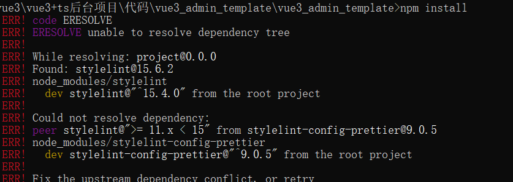
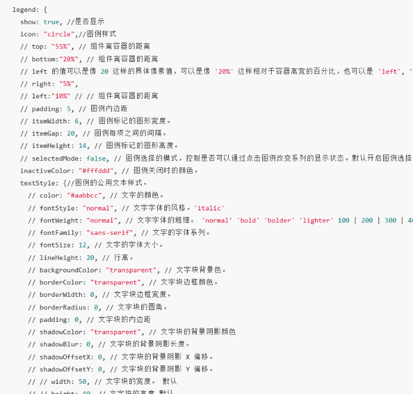

# 一、项目初始化


```
 npm ---- https://registry.npmjs.org/
   cnpm --- http://r.cnpmjs.org/
 * taobao - http://registry.npm.taobao.org/
   edunpm - http://registry.enpmjs.org/
   eu ----- http://registry.npmjs.eu/
   au ----- http://registry.npmjs.org.au/
   sl ----- http://npm.strongloop.com/
   nj ----- https://registry.nodejitsu.com/
   pt ----- http://registry.npmjs.pt/

```




```
npm install --force
```


```shell
npm install ts-node -g
```


```js
import express, {Express, Router, Request, Response} from 'express'

import axios from 'axios'

const app: Express = express()

const router: Router = express.Router()

app.use('/api',router)

router.get('/list',async(req:Request,res:Response)=>{
    const result = await axios.get('http://120.25.222.39/lychee/?page=2')
    res.json({
        data: result.data
    })
})  

app.listen(3333,()=>{
    console.log('success');
    
})


```

```shell
npm init vite@latest
```


# 二、登录功能的实现


# 三 、完成数据可视化

下载插件

```shell
npm install --save lib-flexible
```

vscode安装插件


```shell
npm install animate.css -S
```



```js
tooltip: {
    show: true,    // 是否显示提示框组件
    trigger: 'axis',    // 触发类型（'item'，数据项图形触发，主要在散点图，饼图等无类目轴的图表中使用；'axis'，坐标轴触发，主要在柱状图，折线图等会使用类目轴的图表中使用；'none'，不触发。）
    axisPointer: {
        type: 'cross',    // 指示器类型（'line' 直线指示器；'shadow' 阴影指示器；'none' 无指示器；'cross' 十字准星指示器。）
        snap: false,    // 坐标轴指示器是否自动吸附到点上。默认自动判断。
        label: {
            margin: 10,    // label 距离轴的距离
            color: '#FFF',     // 文字的颜色
            fontStyle: 'normal',    // 文字字体的风格（'normal'，无样式；'italic'，斜体；'oblique'，倾斜字体） 
            fontWeight: 'normal',    // 文字字体的粗细（'normal'，无样式；'bold'，加粗；'bolder'，加粗的基础上再加粗；'lighter'，变细；数字定义粗细也可以，取值范围100至700）
            fontSize: '20',    // 文字字体大小
            lineHeight: '50',    // 行高 
            padding = [5, 7, 5, 7],    // 内边距，单位px 
            backgroundColor = 'auto',    // 文本标签的背景颜色
        },
        animation: true,     // 是否开启动画
        animationDuration: 1000,     // 初始动画时长
        animationDurationUpdate: 200,    // 数据更新动画的时长
    }
    showContent: true,     // 是否显示提示框浮层，默认显示
    alwaysShowContent: true,     // 是否永远显示提示框内容，默认情况下在移出可触发提示框区域后一定时间后隐藏
    triggerOn: 'mousemove|click',    // 提示框触发的条件（'mousemove'，鼠标移动时触发；'click'，鼠标点击时触发；'mousemove|click'，同时鼠标移动和点击时触发；'none'，不在 'mousemove' 或 'click' 时触发）
    confine: true,    // 是否将 tooltip 框限制在图表的区域内
    backgroundColor: 'rgba(50,50,50,0.7)',    // 提示框浮层的背景颜色
    padding: 5,    // 提示框浮层内边距，单位px
    textStyle: {
        color: '#FFF',     // 文字的颜色
        fontStyle: 'normal',    // 文字字体的风格（'normal'，无样式；'italic'，斜体；'oblique'，倾斜字体） 
        fontWeight: 'normal',    // 文字字体的粗细（'normal'，无样式；'bold'，加粗；'bolder'，加粗的基础上再加粗；'lighter'，变细；数字定义粗细也可以，取值范围100至700）
        fontSize: '20',    // 文字字体大小
        lineHeight: '50',    // 行高 
    },
    formatter: function (params) {
        var result = ''
        var dotHtml = '<span style="display:inline-block;margin-right:5px;border-radius:10px;width:30px;height:30px;background-color:#F1E67F"></span>'    // 定义第一个数据前的圆点颜色
        var dotHtml2 = '<span style="display:inline-block;margin-right:5px;border-radius:10px;width:30px;height:30px;background-color:#2BA8F1"></span>'    // 定义第二个数据前的圆点颜色
        result += params[0].axisValue + "</br>" + dotHtml + ' 数据名称 ' + params[0].data + "</br>" + dotHtml2 + ' 数据名称 ' + params[1].data;
        return result
    }
}
```

